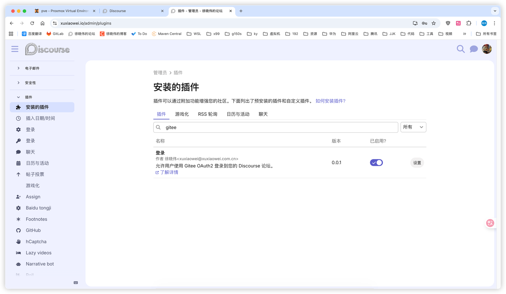
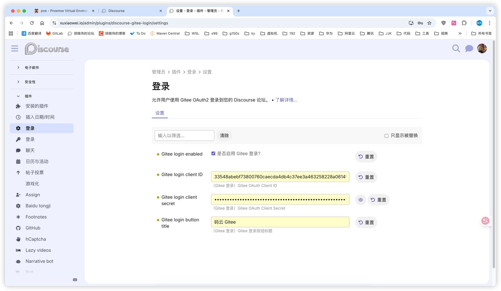

# Discourse Gitee 登录插件

这个插件允许用户使用 Gitee OAuth2 登录到您的 Discourse 论坛。

## 安装

- 将代码克隆到插件目录 `/var/www/discourse/plugins`
    ```shell
    docker exec -it discourse-web-1 bash
    cd /var/www/discourse/plugins
    git clone https://github.com/xuxiaowei-com-cn/discourse-gitee-login.git
    ```
- 重启容器
    ```shell
    docker restart discourse-web-1
    ```

## 配置

1. 前往 Gitee 创建一个新的 OAuth 应用：
    - 访问 [Gitee OAuth 应用](https://gitee.com/oauth/applications)
    - 点击 "创建应用"
    - 填写必填字段：
        - 应用名称：您的论坛名称
        - 应用描述：您的论坛描述
        - 应用主页：您的论坛 URL
        - 授权回调地址：`https://your-forum-url/auth/gitee/callback` （将 `your-forum-url` 替换为您的论坛域名）
    - 点击 "创建应用"

2. 从 Gitee 应用页面复制 `Client ID` 和 `Client Secret`。

3. 在您的 Discourse 管理面板中：
    - 前往 `设置` → `插件` → `Gitee Login`
    - 启用 `gitee_login_enabled` 设置
    - 输入您从 Gitee 复制的 `Client ID` 和 `Client Secret`
    - 根据需要自定义 `gitee_login_button_title`
    - 点击 "保存更改"




## 使用

配置完成后，用户将在登录页面看到 "使用 Gitee 登录" 按钮。他们可以点击此按钮使用其 Gitee 账号进行身份验证并登录到您的论坛。
